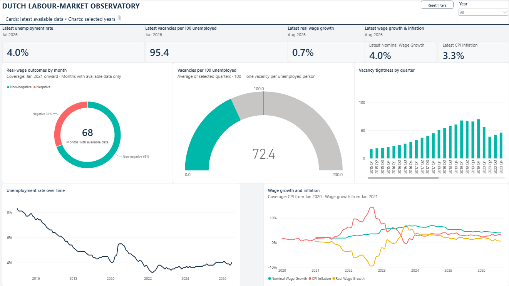
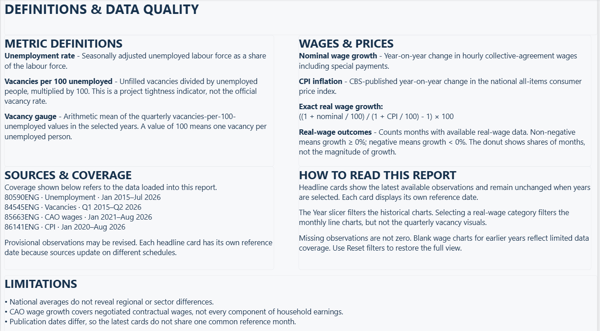

# Dutch Labour-Market Observatory

An English-language decision-support project about Dutch labour-market tightness
and real wage growth, built from official Statistics Netherlands (CBS) data.

**Stack:** Python · DuckDB · dbt · SQL · Power BI

## Explore the report

- [Download the Power BI report](powerbi/dutch_labour_market_observatory.pbix)
  and open it in Power BI Desktop. GitHub does not render the interactive report.
- **Labour-market overview:** latest indicator cards, a Year slicer, real-wage
  outcome donut, vacancy gauge, quarterly vacancy columns, and monthly trends.
- **Definitions & data quality:** definitions, source coverage, interaction
  guidance, and limitations.
- [Build and refresh instructions](powerbi/BUILD_GUIDE.md).
- [Local validation and publication checklist](docs/release_checklist.md).

The PBIX contains an imported data snapshot, not a live feed. Latest observations
in this snapshot range from June to August 2026, depending on the source. Opening
the saved report does not require regenerating the CSVs; refreshing it requires
rebuilding the exports and pointing Power Query at your local copies.

## Report preview

### Labour-market overview



All years are selected. The quarterly chart has a horizontal scrollbar; this
capture shows the earlier quarters, not the full quarterly series at once.
Headline cards show the latest available observations, independently of filters.

### Definitions & data quality



## Findings from the loaded snapshot

- **Unemployment is below its early-2015 level:** the seasonally adjusted rate
  fell from 8.3% in January 2015 to 4.0% in July 2026. This is a historical
  comparison, not a claim that the decline was continuous.
- **Vacancy tightness has eased from its peak:** the quarterly ratio reached
  138.47 vacancies per 100 unemployed in Q1 2022, compared with 95.37 in Q2 2026.
  The latest quarter is provisional. This is a project tightness indicator, not
  the official vacancy rate.
- **Latest real wage growth is positive, but the history includes a squeeze:**
  August 2026 nominal wage growth of 4.0% and CPI inflation of 3.3% imply exact
  real wage growth of approximately 0.7%. Across January 2021–August 2026,
  47 of 68 available months had non-negative real wage growth and 21 had negative
  growth (approximately 69% and 31%). These shares count months, not cumulative
  purchasing-power gains. The latest wage and CPI observations are provisional.

These descriptive findings were checked against the local dashboard exports on
8 October 2026; they do not represent a new source refresh. National averages do
not describe every household or sector, CAO wages are not total earnings, and the
latest cards have different reference periods. Definitions and provenance are in
[the metric contract](docs/metric_definitions.md) and
[source catalogue](config/sources.json).

**Next analytical question:** does the national improvement in real wage growth
also appear across sectors, once comparable sector-level data is available?

## Decision question

Is nominal wage growth keeping ahead of inflation, and is the Dutch labour market
becoming tighter or looser?

The intended audience is a policy analyst, business planner, or recruiter who needs
a concise view of labour demand, unemployment, wages, and purchasing power.

## MVP indicators

- Unemployment rate.
- Number of unemployed people.
- Open vacancies and vacancies per 100 unemployed as a tightness indicator.
- Year-on-year collective-agreement wage growth.
- Consumer-price inflation.
- Exact inflation-adjusted real wage growth:
  `((1 + nominal/100) / (1 + CPI/100) - 1) * 100`.
  The simpler nominal-minus-inflation approximation is retained in the analytical
  mart for comparison, not used as the report's headline real-wage measure.

Definitions and limitations are specified in
[docs/metric_definitions.md](docs/metric_definitions.md).

## Architecture

```text
CBS StatLine OData API
        |
        v
versioned raw JSON snapshots
        |
        v
Python normalization -> DuckDB raw/staging tables
        |
        v
dbt analytical marts + data tests
        |
        v
Power BI report (overview + definitions)
```

The repository contains ingestion, normalization, DuckDB loading, dbt models,
quality checks, CSV export queries, and the two-page Power BI report. A separate
written briefing remains a future deliverable.

## Quick start

Requires Python 3.11 or later.

Run these commands from this repository's root. Raw snapshots, generated CSVs,
the local warehouse, and virtual environments are excluded from Git. The
committed `profiles.yml` uses a relative local DuckDB path and contains no database
credentials.

```powershell
python -m venv .venv
.venv\Scripts\Activate.ps1
python -m pip install -e ".[dev,pipeline,analytics]"
python -m pytest -q
```

Inspect a CBS table's metadata:

```powershell
labour-observatory fetch TABLE_ID --resource TableInfos --output data/raw/table_info.json
```

Download its typed dataset:

```powershell
labour-observatory fetch TABLE_ID --resource TypedDataSet --output data/raw/observations.json
```

Use `--select` and `--filter` for limited API requests after inspecting the table's
metadata. Raw responses include retrieval metadata and are written atomically. An
empty API result fails without creating a snapshot; `--allow-empty` is available
only when an empty result is intentional.

### Reproduce the unemployment snapshot

From this project directory in PowerShell:

```powershell
$env:PYTHONPATH = "$PWD\src"
python -m dutch_labour_observatory.cli fetch 80590ENG `
  --resource TypedDataSet `
  --select Sex Age Periods SeasonallyAdjusted_6 SeasonallyAdjusted_8 `
  --filter "Sex eq 'T001038' and Age eq '52052   ' and substringof('MM', Periods)" `
  --output data/raw/unemployment_monthly_full_history.json
```

This intentionally retrieves all available monthly history. The staging layer will
apply the analysis cutoff of January 2015.

Normalize and validate that raw snapshot:

```powershell
python -m dutch_labour_observatory.cli transform-unemployment `
  --input data/raw/unemployment_monthly_full_history.json `
  --output data/processed/unemployment_monthly_2015_onward.csv
```

The resulting columns are documented in
[docs/data_dictionary.md](docs/data_dictionary.md).

Load the staging CSV into DuckDB and run the first analytical query:

```powershell
python -m dutch_labour_observatory.cli load-unemployment `
  --input data/processed/unemployment_monthly_2015_onward.csv `
  --database data/warehouse/labour_market.duckdb `
  --schema sql/schema.sql

python -m dutch_labour_observatory.cli query `
  --database data/warehouse/labour_market.duckdb `
  --sql sql/analysis/unemployment_annual_summary.sql
```

The load is a transactional full refresh: rerunning it replaces the table and does
not create duplicates.

Run the warehouse data-quality checks:

```powershell
python -m dutch_labour_observatory.cli check-quality `
  --database data/warehouse/labour_market.duckdb `
  --sql sql/quality/unemployment_quality_checks.sql
```

The checks are documented in [docs/data_quality.md](docs/data_quality.md).

### Reproduce the vacancy sample

```powershell
python -m dutch_labour_observatory.cli fetch 84545ENG `
  --resource TypedDataSet `
  --select Periods VacanciesSeasonallyAdjustedUnfilled_1 `
  --filter "Periods eq '2025KW01' or Periods eq '2025KW02' or Periods eq '2025KW03'" `
  --output data/raw/vacancies_2025_q1_q3.json
```

This sample is intentionally small. For the complete pipeline, retrieve the
quarterly history and its publication-status metadata:

```powershell
python -m dutch_labour_observatory.cli fetch 84545ENG `
  --resource TypedDataSet `
  --select Periods VacanciesSeasonallyAdjustedUnfilled_1 `
  --filter "substringof('KW', Periods)" `
  --output data/raw/vacancies_quarterly_full_history.json

python -m dutch_labour_observatory.cli fetch 84545ENG `
  --resource Periods `
  --output data/raw/vacancy_periods_metadata.json
```

Normalize and load the complete vacancy series:

```powershell
python -m dutch_labour_observatory.cli transform-vacancies `
  --input data/raw/vacancies_quarterly_full_history.json `
  --period-metadata data/raw/vacancy_periods_metadata.json `
  --output data/processed/vacancies_quarterly_2015_onward.csv

python -m dutch_labour_observatory.cli load-vacancies `
  --input data/processed/vacancies_quarterly_2015_onward.csv `
  --database data/warehouse/labour_market.duckdb `
  --schema sql/schema.sql

python -m dutch_labour_observatory.cli check-quality `
  --database data/warehouse/labour_market.duckdb `
  --sql sql/quality/vacancy_quality_checks.sql
```

### Reproduce the wage sample

```powershell
python -m dutch_labour_observatory.cli fetch 85663ENG `
  --resource TypedDataSet `
  --select CaoSector SectorBranchesSIC2008 Version Periods `
    HourlyCaoWagesInclSpecialPayments_4 `
    HourlyCaoWagesInclSpecialPayments_11 `
  --filter "CaoSector eq 'T001020' and SectorBranchesSIC2008 eq 'T001081' and Version eq 'A045600   ' and (Periods eq '2025MM12' or Periods eq '2026MM01' or Periods eq '2026MM02')" `
  --output data/raw/wages_2025_dec_2026_feb.json
```

The 2020-base monthly series starts in 2020. The MVP does not splice it to a
discontinued earlier index series.

Retrieve the complete monthly wage history and its period metadata:

```powershell
python -m dutch_labour_observatory.cli fetch 85663ENG `
  --resource TypedDataSet `
  --select CaoSector SectorBranchesSIC2008 Version Periods `
    HourlyCaoWagesInclSpecialPayments_4 HourlyCaoWagesInclSpecialPayments_11 `
  --filter "CaoSector eq 'T001020' and SectorBranchesSIC2008 eq 'T001081' and Version eq 'A045600   ' and substringof('MM', Periods)" `
  --output data/raw/wages_monthly_full_history.json

python -m dutch_labour_observatory.cli fetch 85663ENG `
  --resource Periods `
  --output data/raw/wage_periods_monthly_metadata.json
```

Normalize the complete observations, join the period-status metadata, load the
result into DuckDB, and run its checks:

```powershell
python -m dutch_labour_observatory.cli transform-wages `
  --input data/raw/wages_monthly_full_history.json `
  --period-metadata data/raw/wage_periods_monthly_metadata.json `
  --output data/processed/wages_monthly_2020_onward.csv

python -m dutch_labour_observatory.cli load-wages `
  --input data/processed/wages_monthly_2020_onward.csv `
  --database data/warehouse/labour_market.duckdb `
  --schema sql/schema.sql

python -m dutch_labour_observatory.cli check-quality `
  --database data/warehouse/labour_market.duckdb `
  --sql sql/quality/wage_quality_checks.sql

python -m dutch_labour_observatory.cli query `
  --database data/warehouse/labour_market.duckdb `
  --sql sql/analysis/wage_annual_summary.sql
```

The published year-on-year field is unavailable for all twelve months of 2020
because the source starts in 2020. Those nulls are retained; missing growth values
after 2020 fail the quality checks.

### Reproduce the CPI sample

```powershell
python -m dutch_labour_observatory.cli fetch 86141ENG `
  --resource TypedDataSet `
  --select ExpenditureCategories Periods CPI_1 AnnualRateOfChangeCPI_5 `
  --filter "ExpenditureCategories eq 'T001112  ' and (Periods eq '2025MM12' or Periods eq '2026MM01' or Periods eq '2026MM02')" `
  --output data/raw/cpi_2025_dec_2026_feb.json
```

`T001112  ` is the all-items category and contains two significant trailing spaces.
The selected CPI is based on 2025=100, and the published annual rate is used as the
inflation measure.

Retrieve the complete monthly observations and period metadata:

```powershell
python -m dutch_labour_observatory.cli fetch 86141ENG `
  --resource TypedDataSet `
  --select ExpenditureCategories Periods CPI_1 AnnualRateOfChangeCPI_5 `
  --filter "ExpenditureCategories eq 'T001112  ' and substringof('MM', Periods)" `
  --output data/raw/cpi_monthly_full_history.json

python -m dutch_labour_observatory.cli fetch 86141ENG `
  --resource Periods `
  --output data/raw/cpi_periods_metadata.json
```

Normalize, load, validate, and summarize the CPI series:

```powershell
python -m dutch_labour_observatory.cli transform-cpi `
  --input data/raw/cpi_monthly_full_history.json `
  --period-metadata data/raw/cpi_periods_metadata.json `
  --output data/processed/cpi_monthly_2020_onward.csv

python -m dutch_labour_observatory.cli load-cpi `
  --input data/processed/cpi_monthly_2020_onward.csv `
  --database data/warehouse/labour_market.duckdb `
  --schema sql/schema.sql

python -m dutch_labour_observatory.cli check-quality `
  --database data/warehouse/labour_market.duckdb `
  --sql sql/quality/cpi_quality_checks.sql

python -m dutch_labour_observatory.cli query `
  --database data/warehouse/labour_market.duckdb `
  --sql sql/analysis/cpi_annual_summary.sql
```

### Build the wage-and-price analytical mart

The dbt project aligns monthly wage and CPI observations and calculates exact real
wage growth. The model starts in January 2021 because the wage source has no
published year-on-year change during its 2020 baseline year.

```powershell
dbt debug --profiles-dir .
dbt build --profiles-dir .

python -m dutch_labour_observatory.cli query `
  --database data/warehouse/labour_market.duckdb `
  --sql sql/analysis/real_wage_annual_summary.sql
```

`fct_wages_prices` retains the published nominal wage and inflation rates, their
source statuses, the exact inflation-adjusted result, and the simpler
nominal-minus-inflation approximation. `agg_wages_prices_annual` provides a compact
annual summary. Both are built in the DuckDB `analytics` schema.

The same dbt build also creates:

- `dim_month`, a continuous calendar from January 2015 through the latest monthly
  source observation.
- `fct_labour_market_periodic`, a monthly dashboard table anchored on unemployment
  and enriched with CPI, wages, and real wage growth when available.
- `fct_vacancies`, a quarterly table with vacancy change and vacancies per 100
  unemployed, aligned to unemployment in the quarter's final month.

Review their annual summaries:

```powershell
python -m dutch_labour_observatory.cli query `
  --database data/warehouse/labour_market.duckdb `
  --sql sql/analysis/labour_market_annual_summary.sql

python -m dutch_labour_observatory.cli query `
  --database data/warehouse/labour_market.duckdb `
  --sql sql/analysis/vacancy_tightness_annual_summary.sql
```

### Export the Power BI datasets

Build and test the models before exporting the four dashboard datasets:

```powershell
dbt build --profiles-dir .

python -m dutch_labour_observatory.cli export `
  --database data/warehouse/labour_market.duckdb `
  --sql sql/dashboard/dim_month.sql `
  --output data/dashboard/dim_month.csv

python -m dutch_labour_observatory.cli export `
  --database data/warehouse/labour_market.duckdb `
  --sql sql/dashboard/monthly_trends.sql `
  --output data/dashboard/monthly_trends.csv

python -m dutch_labour_observatory.cli export `
  --database data/warehouse/labour_market.duckdb `
  --sql sql/dashboard/quarterly_tightness.sql `
  --output data/dashboard/quarterly_tightness.csv

python -m dutch_labour_observatory.cli export `
  --database data/warehouse/labour_market.duckdb `
  --sql sql/dashboard/headline_kpis.sql `
  --output data/dashboard/headline_kpis.csv
```

The layout, relationships, formatting, and accessibility choices are specified in
[docs/dashboard_spec.md](docs/dashboard_spec.md).

### Assemble the Power BI report

Open the four exported CSV files in Power BI Desktop, then follow
[`powerbi/BUILD_GUIDE.md`](powerbi/BUILD_GUIDE.md). The repository includes a
report theme and copy-ready DAX measures so the two report pages can be reproduced
and reviewed without inventing formatting or metric logic in the desktop file.

## Current status

- [x] MVP question and scope.
- [x] Metric definitions and limitations.
- [x] Reusable, paginated CBS OData client.
- [x] Unit tests for calculations and ingestion behavior.
- [x] Verify the unemployment table and its MVP dimension keys.
- [x] Retrieve and inspect a three-row raw unemployment snapshot.
- [x] Retrieve and validate the complete monthly unemployment history.
- [x] Normalize unemployment records and apply the January 2015 staging cutoff.
- [x] Load the clean unemployment data into DuckDB and run an annual summary.
- [x] Add database-level unemployment data-quality checks.
- [x] Select, verify, and sample the quarterly vacancy source.
- [x] Retrieve, normalize, validate, and load the complete vacancy history.
- [x] Select, verify, and sample the monthly negotiated-wage source.
- [x] Retrieve, normalize, validate, and load the complete wage history.
- [x] Add wage-specific database quality checks and an annual summary.
- [x] Select, verify, and sample the current monthly CPI source.
- [x] Retrieve, normalize, validate, and load the complete CPI history.
- [x] Add CPI-specific database quality checks and an annual summary.
- [x] Add the dbt wage-price mart, exact real wage growth, and model tests.
- [x] Add the date, unemployment, and vacancy analytical marts.
- [x] Add tested dashboard models, CSV exports, and a dashboard specification.
- [x] Package the Power BI theme, measures, and visual validation checklist.
- [x] Build the two-page Power BI report.
- [x] Add screenshots of both report pages and a snapshot findings summary.
- [ ] Complete remaining visual acceptance checks in the release checklist.
- [ ] Write a separate two-page briefing.

The actionable task list is in [BACKLOG.md](BACKLOG.md), and source-selection
decisions are recorded in [docs/source_audit.md](docs/source_audit.md).

## Data provenance

The project uses primary CBS StatLine datasets under the terms shown by CBS. Every
source must be recorded in `config/sources.json` with its table ID, title, URL,
retrieval date, update frequency, and known limitations. Do not silently replace a
discontinued series: record the change in `docs/decisions.md`.
